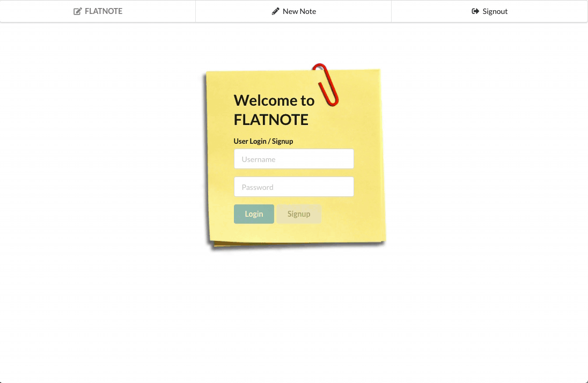

Don't get caught saying "Oh CRUD, I should've made a note!" Users can leave notes on stickies for themselves and never forget anything again.

The Rails backend can be found here: https://github.com/kylefarmer85/rails-flatnote-api

Tech: React, Redux, Ruby on Rails, RESTful APIs, Semantic UI, PostgreSQL, Thunk, JWT, bcrypt

To use:
Clone and navigate to the Flatnote Rails backend and run budle install in the terminal. Run rails s in the terminal to connect to localhost:3000. Clone and navigate to Flatnote React frontend. Run npm install in the terminal. Run npm start in the terminal and connect to localhost:3001.
